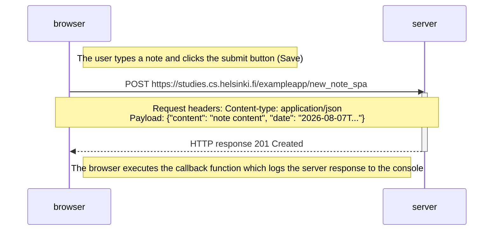

```mermaid
sequenceDiagram
    participant browser
    participant server

    Note right of browser: The user types a note and clicks the submit button (Save)

    browser->>server: POST https://studies.cs.helsinki.fi/exampleapp/new_note_spa
    activate server
    Note over browser,server: Request headers: Content-type: application/json<br>Payload: {"content": "note content", "date": "2026-08-07T..."}
    server-->>browser: HTTP response 201 Created
    deactivate server

    Note right of browser: The browser executes the callback function which logs the server response to the console
```
